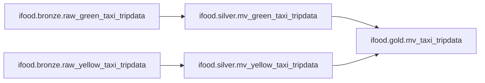

# Case Técnico Data Architect - iFood

Pipeline de dados construída no Databricks para ingestão, transformação e disponibilização analítica dos dados do (https://www.nyc.gov/site/tlc/about/tlc-trip-record-data.page), seguindo a **Medallion Architecture**

---

## Premissas

### Orquestração

Foi utilizado o Declarative Pipelines do Databricks como mecanismo de orquestração, evitando dependências externas (ex.: Airflow, dbt) e simplificando o setup do ambiente de desenvolvimento.

### Landing Zone

Os arquivos de origem foram carregados em um **volume interno do Unity Catalog**, evitando a necessidade de configurar um storage de objeto externo (ex.: S3, GCS). O volume funciona como landing zone, servindo de entrada manual para a camada Bronze.

### Modelo de Dados

A pipeline segue a **Medallion Architecture**, organizando os dados em três camadas com responsabilidades distintas.

### Ferramentas de Desenvolvimento

O **DuckDB** foi utilizado para exploração local dos arquivos Parquet e entendimento inicial dos dados. O desenvolvimento da solução foi realizado no **Databricks Community Edition**.

### Uso de IA

A IA foi utilizada como apoio na formatação dos READMEs do projeto e correção ortográfica.

### Linguagem

A solução foi desenvolvida inteiramente em **SQL**, por familiaridade com a linguagem.

### Atualização dos Dados

Não foi adotada nenhuma estratégia de refresh automático. Os arquivos são carregados manualmente no volume e a pipeline é executada manualmente via Jobs & Pipelines. Essa decisão foi tomada para manter a simplicidade do ambiente de desenvolvimento, dado o escopo do case.

---

## Arquitetura



---

## Estrutura do Projeto

```
ifood-case/
├── analysis/
│   ├── Analysis -> Respostas das perguntas nos formatos .sql e html. 
│   └── Exploration -> Exploração dos dados brutos e da camanada bronze nos formatos .py e html. 
└── src/
    └── transformations/
        ├── bronze/
        │   ├── bronze.raw_green_taxi_tripdata.sql
        │   ├── bronze.raw_yellow_taxi_tripdata.sql
        │   └── README.md
        ├── silver/
        │   ├── silver.mv_green_taxi_tripdata.sql
        │   ├── silver.mv_yellow_taxi_tripdata.sql
        │   └── README.md
        └── gold/
            ├── gold.mv_taxi_tripdata.sql
            └── README.md
```

---

## Preparação do Ambiente

Antes de executar a pipeline, é necessário criar o catálogo, os schemas e os volumes no Unity Catalog:

```sql
-- Catálogo e schemas
CREATE CATALOG IF NOT EXISTS ifood;
CREATE SCHEMA IF NOT EXISTS ifood.bronze;
CREATE SCHEMA IF NOT EXISTS ifood.silver;
CREATE SCHEMA IF NOT EXISTS ifood.gold;

-- Volumes
CREATE VOLUME IF NOT EXISTS ifood.nyc.yellow_tripdata;
CREATE VOLUME IF NOT EXISTS ifood.nyc.green_tripdata;
```

Após a criação dos volumes, os arquivos Parquet devem ser carregados manualmente nos respectivos caminhos:

- `/Volumes/ifood/nyc/yellow_tripdata/`
- `/Volumes/ifood/nyc/green_tripdata/`

## Documentação das Camadas

- [Bronze Layer](https://github.com/valdineyvgomes/data-architect-technical-case/blob/main/ifood-case/src/transformations/bronze/README.md): Responsável pela ingestão dos arquivos Parquet originais, preservando os dados o mais próximo possível da fonte.
- [Silver Layer](https://github.com/valdineyvgomes/data-architect-technical-case/blob/main/ifood-case/src/transformations/silver/README.md): Responsável por preparar os dados da camada Bronze para consumo analítico, aplicando padronizações, ajustes de schema e conversões de tipos de dados.
- [Gold Layer](https://github.com/valdineyvgomes/data-architect-technical-case/blob/main/ifood-case/src/transformations/gold/README.md): Responsável pela unificação e enriquecimento dos dados das duas frotas de táxi, consolidando os registros de Yellow e Green Taxi em uma única tabela analítica.
