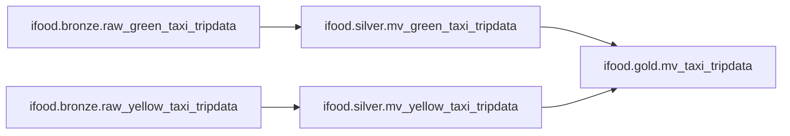

# Case Técnico Data Architect - iFood

Pipeline de dados construída no Databricks para ingestão, transformação e disponibilização analítica dos dados do (https://www.nyc.gov/site/tlc/about/tlc-trip-record-data.page), seguindo a **Medallion Architecture**

---

## Premissas

### Uso de IA

A IA foi utilizada como apoio na formatação dos READMEs do projeto e correção ortográfica.

### Orquestração

Foi utilizado o Declarative Pipelines do Databricks como mecanismo de orquestração, evitando dependências externas (ex.: Airflow, dbt) e simplificando o setup do ambiente de desenvolvimento.

### Landing Zone

Os arquivos de origem foram carregados em um **volume interno do Unity Catalog**, evitando a necessidade de configurar um storage de objeto externo (ex.: S3, GCS). O volume funciona como landing zone, servindo de entrada manual para a camada Bronze.

### Modelo de Dados

A pipeline segue a **Medallion Architecture**, organizando os dados em três camadas com responsabilidades distintas:

| Camada | Responsabilidade |
|--------|-----------------|
| Bronze | Ingestão dos dados brutos preservando a fonte |
| Silver | Padronização, limpeza e ajustes de schema |
| Gold   | Unificação e enriquecimento para consumo analítico |

### Ferramentas de Desenvolvimento

O **DuckDB** foi utilizado para exploração local dos arquivos Parquet e entendimento inicial dos dados. O desenvolvimento da solução foi realizado no **Databricks Community Edition**.

### Linguagem

A solução foi desenvolvida inteiramente em **SQL**, por familiaridade com a linguagem.

### Atualização dos Dados

Não foi adotada nenhuma estratégia de refresh automático. Os arquivos são carregados manualmente no volume e a pipeline é executada manualmente via Jobs & Pipelines. Essa decisão foi tomada para manter a simplicidade do ambiente de desenvolvimento, dado o escopo do case.

---

## Arquitetura



---

## Estrutura do Projeto

```
ifood-case/
├── analysis/
│   ├── Analysis -> Respostas das perguntas nos formatos .sql e html. 
│   └── Exploration -> Exploração dos dados brutos e da camanada bronze nos formatos .py e html. 
└── src/
    └── transformations/
        ├── bronze/
        │   ├── bronze.raw_green_taxi_tripdata.sql
        │   ├── bronze.raw_yellow_taxi_tripdata.sql
        │   └── README.md
        ├── silver/
        │   ├── silver.mv_green_taxi_tripdata.sql
        │   ├── silver.mv_yellow_taxi_tripdata.sql
        │   └── README.md
        └── gold/
            ├── gold.mv_taxi_tripdata.sql
            └── README.md
```

---

## Preparação do Ambiente

Antes de executar a pipeline, é necessário criar o catálogo, os schemas e os volumes no Unity Catalog:

```sql
-- Catálogo e schemas
CREATE CATALOG IF NOT EXISTS ifood;
CREATE SCHEMA IF NOT EXISTS ifood.bronze;
CREATE SCHEMA IF NOT EXISTS ifood.silver;
CREATE SCHEMA IF NOT EXISTS ifood.gold;

-- Volumes
CREATE VOLUME IF NOT EXISTS ifood.nyc.yellow_tripdata;
CREATE VOLUME IF NOT EXISTS ifood.nyc.green_tripdata;
```

Após a criação dos volumes, os arquivos Parquet devem ser carregados manualmente nos respectivos caminhos:

- `/Volumes/ifood/nyc/yellow_tripdata/`
- `/Volumes/ifood/nyc/green_tripdata/`

---

## Bronze Layer

Responsável pela ingestão dos arquivos Parquet originais, preservando os dados o mais próximo possível da fonte.

| Dataset | Volume (Landing Zone) | Destino (Bronze) |
|---|---|---|
| `yellow_tripdata` | `/Volumes/ifood/nyc/yellow_tripdata/` | `ifood.bronze.raw_yellow_taxi_tripdata` |
| `green_tripdata` | `/Volumes/ifood/nyc/green_tripdata/` | `ifood.bronze.raw_green_taxi_tripdata` |

### Campos Técnicos

| Campo | Descrição |
|---|---|
| `_rescued_data` | Armazena dados que não puderam ser interpretados durante a leitura do arquivo |
| `source_file` | Caminho do arquivo de origem |
| `source_file_modified_at` | Data de última modificação do arquivo de origem |
| `ingestion_at` | Momento em que o registro foi ingerido |

### Decisões Técnicas

A ingestão utiliza Streaming Tables, uma vez que os arquivos de origem são imutáveis e novos dados são disponibilizados apenas pela adição de novos arquivos. Esse modelo permite que a pipeline processe incrementalmente apenas os dados ainda não ingeridos.

Os `schemaHints` foram configurados para refletir o schema predominante no conjunto de dados. Sem essa configuração, o arquivo de janeiro de 2023 — primeiro a ser processado durante a inferência de schema — acabava sendo utilizado como referência para os demais arquivos, gerando incompatibilidades de tipo.

### Problemas Encontrados

Os arquivos Parquet referentes a `2023-01` apresentam diferenças de schema em relação aos demais meses. Para garantir a ingestão sem perda de informação, o campo `_rescued_data` foi habilitado.

| Arquivo | Campo | Tipo |
|---|---|---|
| `yellow_tripdata_2023-01.parquet` | `passenger_count` | `DOUBLE` |
| `yellow_tripdata_2023-02.parquet` | `passenger_count` | `BIGINT` |

---

## Silver Layer

Responsável por preparar os dados da camada Bronze para consumo analítico, aplicando padronizações, ajustes de schema e conversões de tipos de dados.

| Origem (Bronze) | Destino (Silver) |
|---|---|
| `ifood.bronze.raw_yellow_taxi_tripdata` | `ifood.silver.mv_yellow_taxi_tripdata` |
| `ifood.bronze.raw_green_taxi_tripdata` | `ifood.silver.mv_green_taxi_tripdata` |

### Campos Adicionados

| Campo | Descrição |
|---|---|
| `type_id` | Identifica o tipo de táxi: `1` para Yellow Taxi, `2` para Green Taxi |
| `processed_at` | Timestamp da última atualização da Materialized View |

Todos os campos não necessários para responder às perguntas do case foram removidos.

### Campos Transformados

Devido às diferenças de schema presentes nos arquivos de janeiro de 2023, alguns campos receberam tratamento específico — o valor é obtido da coluna original e, quando ausente, recuperado a partir de `_rescued_data`.

| Campo | Lógica de recuperação |
|---|---|
| `vendor_id` | Lê `VendorID`; se ausente, busca em `_rescued_data` |
| `passenger_count` | Lê `passenger_count`; se ausente, busca em `_rescued_data` |

### Decisões Técnicas

A camada foi implementada com Materialized Views, uma vez que seus dados são totalmente derivados da Bronze.

### Problemas Encontrados

Durante a exploração dos dados na camada Bronze, foram identificados registros com valores inconsistentes em `total_amount` e na duração das corridas. Para definir os limites de filtragem, foi realizada uma análise de percentis e, com base nos resultados, foram definidos os seguintes filtros para remoção de registros inválidos:

- O limite de `total_amount` entre `1` e `180` cobrindo o p99.9 de ambas as frotas com margem adequada, descartando valores nulos, negativos ou anômalos.
- A duração entre `1` e `90` minutos elimina corridas instantâneas ou excessivamente longas, cobrindo o p99.9 de ambas as frotas com margem adequada.
- Registros com `passenger_count` igual a `0`, `null` ou acima da capacidade do veículo foram **mantidos**, pois, conforme a [documentação oficial](https://www.nyc.gov/assets/tlc/downloads/pdf/trip_record_user_guide.pdf), esse campo é *driver-reported* e suscetível a erro humano.

---

## Gold Layer

Responsável pela unificação e enriquecimento dos dados das duas frotas de táxi, consolidando os registros de Yellow e Green Taxi em uma única tabela analítica.

| Origem (Silver) | Destino (Gold) |
|---|---|
| `ifood.silver.mv_yellow_taxi_tripdata` | `ifood.gold.mv_taxi_tripdata` |
| `ifood.silver.mv_green_taxi_tripdata` | `ifood.gold.mv_taxi_tripdata` |

### Campos Adicionados

Extraídos de `pickup_datetime` para facilitar análises temporais:

| Campo | Descrição |
|---|---|
| `trip_year` | Ano da corrida |
| `trip_month` | Mês da corrida |
| `trip_day` | Dia da corrida |
| `trip_hour` | Hora da corrida |

Campos técnicos da tabela final:

| Campo | Descrição |
|---|---|
| `updated_at` | Timestamp da última atualização da Materialized View |

### Decisões Técnicas

A camada foi implementada com **Materialized Views**, seguindo o mesmo padrão da Silver. A unificação dos dados é feita via `UNION ALL` das duas views da camada anterior, garantindo que todos os registros de ambas as frotas sejam consolidados sem deduplicação.

Os campos `type_name` e `vendor_name` são derivados diretamente via `CASE` na própria view, evitando a necessidade de tabelas auxiliares de lookup.

